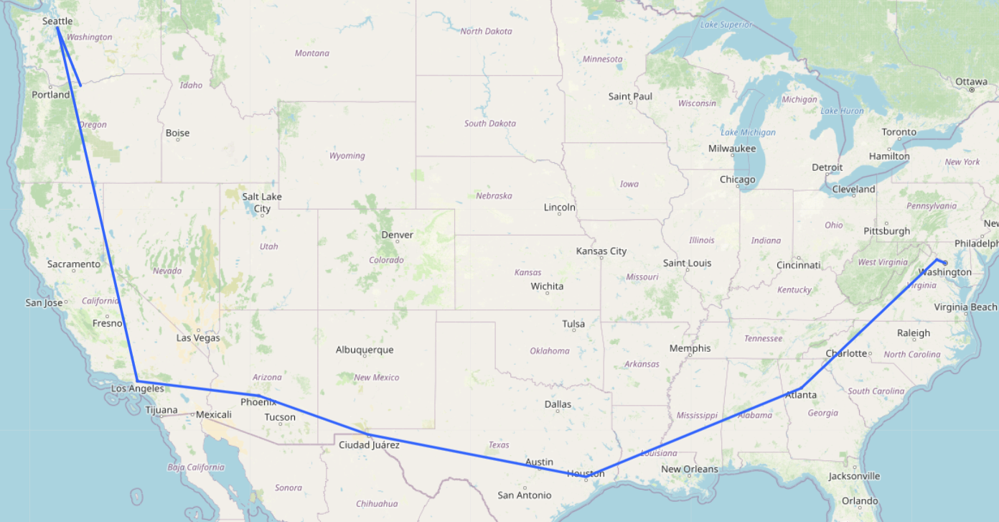
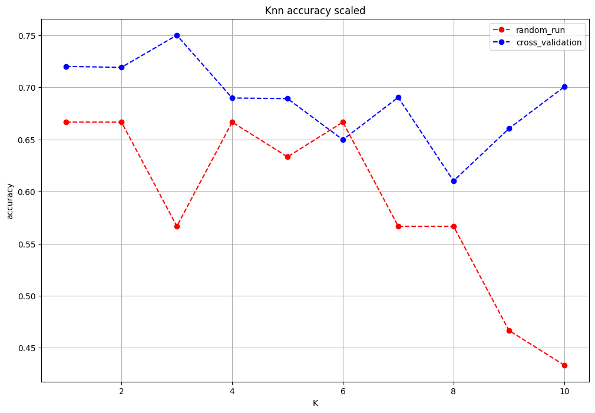
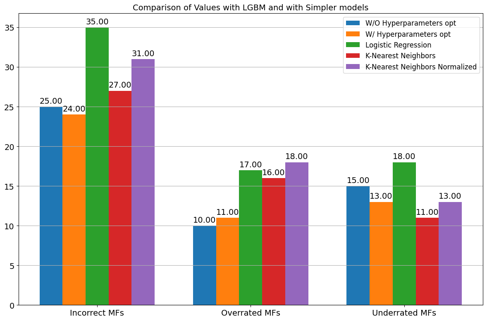

# Network Laboratory & QoT Estimation Project

This repository contains the coursework and final project for the **Network Laboratory** course. The work is structured into two practical homework assignments focused on network analysis and traffic monitoring, followed by a final group project applying Machine Learning techniques to Optical Networks.

## 📂 Repository Structure

* **`NetLab_hom1.ipynb`**: Homework 1 - Active Network Measurements & Geolocation.
* **`NetLabHom2.ipynb`**: Homework 2 - Passive Traffic Analysis & Packet Capturing.
* **`PROJECT5_GROUP_H.ipynb`**: Final Project - Quality of Transmission (QoT) Estimation (Group H).

---

## 1. Homework 1: Active Measurements & Geolocation

This notebook focuses on **active network diagnostics** using Python. It utilizes tools like `scapy`, `pythonping`, and `requests` to analyze network performance, routing paths, and server locations.

### Key Features:
* **Traceroute Analysis:** Probing paths to various servers to analyze hops and latency.
* **RTT Statistics:** Calculating Round Trip Time statistics (min/avg/max) to evaluate connection stability.
* **IP Geolocation:** Mapping the physical location of routers and servers along a network path using `geopy`.
* **Visualization:** Generating interactive maps of network paths using `folium`.



---

## 2. Homework 2: Traffic Analysis & Sniffing

This notebook deals with **passive network measurements**. It establishes an environment to capture, parse, and analyze network traffic using `tcpdump`, `tshark`, and `scapy`.

### Key Features:
* **Packet Sniffing:** Capturing live traffic on specific network interfaces.
* **Protocol Analysis:** Deep inspection of headers (IP, TCP, UDP, DNS) to understand traffic composition.
* **Traffic Statistics:** Analyzing packet size distributions, inter-arrival times, and overall throughput.
* **Library Integration:** Leveraging `pyshark` for parsing .pcap files and `scapy` for packet manipulation.



---

## 3. Final Project: QoT Estimation in Optical Networks

**Group H Members:**
* Pablo Eduardo Revelo Samaniego
* Mattia Fiore
* Pasquale Lobaccaro

### Project Overview
This project addresses the challenge of estimating the **Quality of Transmission (QoT)** in optical networks. Using a dataset of lightpath features, we developed Machine Learning models to predict signal quality and classification.

### Methodology:
* **Data Preprocessing:** Cleaning and feature engineering on optical network node data.
* **Model Implementation:** Utilizing **LightGBM (LGBM)** for both classification and probabilistic regression.
* **Performance:** The models achieved high accuracy (**~96-97%**), effectively identifying correct modulation formats.
* **Granularity Analysis:** Comparison of model performance using continent-level vs. country-level node features.



---

## 🛠️ Requirements & Installation

To run these notebooks, ensure you have the following Python libraries and system tools installed.

**System Tools (Linux/Colab):**

```bash
sudo apt-get install curl tshark tcpdump dnsutils
```
## Python Libraries:

```bash
pip install --pre scapy[basic]
pip install pyshark pythonping geopy folium lightgbm pandas matplotlib
```

## 🚀 Usage

Clone this repository.

Open the notebooks using Jupyter Lab or Google Colab.

Run the cells sequentially.

Note for HW2: Ensure you have administrative privileges (root/sudo) to capture packets if running locally.

## 👤 Authors

Project developed for the Network Laboratory course. Group H: Mattia Fiore, Pasquale Lobaccaro, Pablo Revelo Samaniego. 